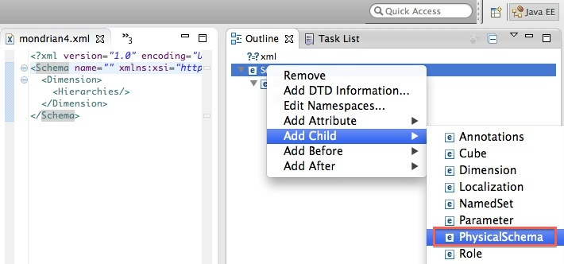

# Mondrian 4: Get ready!

Mondrian is a very popular open source analytical engine which is used in various offerings (like Pentaho BA Server, JasperSoft BI Server). Mondrian 4 brings a whole bunch of new features, some of which we will discuss in this blog post.

## Prerequisite


You are familiar with XMLYou are familiar with OLAPYou are familiar with the command line on a Linux OS or Mac OS. Download Eclipse IDE for Java EE Developers from [here](http://www.eclipse.org/downloads/). Users unfamiliar with Java, don’t worry, we won’t write a single line of Java! We will use Eclipse only to create an OLAP schema.Download the Mondrian 4 version of Saiku from [here](http://ci.analytical-labs.com/job/saiku-mondrian4/). We will use it to test the schema. Please note that this branch is in active development and not suitable for production use! If you need a version for production use (currently without Mondrian 4 support), download it from the [main website](http://analytical-labs.com/).This post is not really a step by step tutorial, more a kind of general overview, so it is recommended that you have a data set (ideally a data mart) so that you can follow along and create your own OLAP schema.All my files related to this post can be download [here](https://docs.google.com/folder/d/0B-yuO-Oixq4RbklKMkFiUU5hYXM/edit).


## What’s new

- Dimensions are now loosely set up using Attributes. The can be part of a hierarchy but they don’t have to. If defined in a hierarchy, they can still be used on their own.

- MeasureGroups can be used to define Measures from more than one fact table (that have the same dimensionality and granularity).

- - There are no aggregated patterns any more, use MeasureGroups for defining aggregates.
  - Virtual Cubes are depreciated

- Schema Workbench is discontinued. Write the OLAP Schema in a text/XML editor of your choice

- No XMLA server, spin off project OLAP4J xmla server

- Built-in time dimension generator

## A quick overview of the new syntax

We will quickly have a high level overview of the new syntax. I highly recommend obtaining the forthcoming book

 *Mondrian In Action*

 for more detailed instructions. Also, if you don’t know the purpose of an XML element or attribute, you can find a description in the

 Mondrian API documentation.

### High level structure

Please find below a simplified structural overview of the OLAP schema definition:

```xml
<?xml version="1.0" encoding="UTF-8"?>

<!DOCTYPE Schema SYSTEM "mondrian.dtd" >

<Schema metamodelVersion="4.0">

 <!-- Define how the DB tables are set up -->

 <PhysicalSchema>

  <!-- Specify source tables -->

  <Table/>

  <!-- Define relationships between snowflake or alias tables, not direct dim tables! -->

  <Link/>

 </PhysicalSchema>

 <!-- Create your cube definition and reference back to the physical schema -->

 <Cube>

  <!-- Define dimensions and attributes -->

  <Dimensions>

   <Dimension>

    <Attribute/>

   </Dimension>

   <Hierarchies>

    <Hierarchy>

     <Level/>

    </Hierarchy>

   </Hierarchies>

  </Dimensions>

  <!-- Define Measures -->

  <MeasureGroups>

   <MeasureGroup>

    <Measures>

     <Measure/>

    </Measures>

    <DimensionLinks>

     <ForeignKeyLink/>

     <FactLink/>

    </DimensionLinks>

   </MeasureGroup>

  </MeasureGroups>

  <!-- Define Calculated Members and Names Sets -->

  <CalculatedMembers/>

  <NamedSets/>

 </Cube>

 <!-- If you have conformed dimensions, specify them globally.-->

 <Dimension>

 <!-- Define roles below to restrict access to the cube(s). -->

 <Role>

</Schema>

```

Note that Mondrian 4 is not sensitive to the order you mention these building blocks, so you can mention the cube before the physical schema in example.  

### How to define the physical schema

The physical schema defines how your database tables are set up:

```xml


<PhysicalSchema>

       <Table name='employee'>

           <Key>

               <Column name='employee_id'/>

           </Key>

       </Table>

       <Table name='store'>

           <Key>

               <Column name='store_id'/>

           </Key>

       </Table>

       <Link source='store' target='employee'>

           <ForeignKey>

               <Column name='store_id'/>

           </ForeignKey>

       </Link>

…

</PhysicalSchema>

```


Note: The <Link> element is only used to describe the relationship to alias tables or snowflaked tables (so tables that are more than one link away from the fact table).

### How to define dimensions

Dimensions are defined with the <Dimension> element and their members with the <Attribute> element. Mondrian will by default create a hierarchy for every attribute you create unless you specify <Attribute hasHierarchy=”false”>. There is an optional <Hiearchy> element for specifying multi-level hierarchies.


```xml
          

 <Dimension name='Promotion' table='promotion' key='Promotion Id'>

               <Attributes>

                   <Attribute name='Promotion Id' keyColumn='promotion_id' hasHierarchy='false'/>

                   <Attribute name='Promotion Name' keyColumn='promotion_name' hasHierarchy='false'/>

                   <Attribute name='Media Type' keyColumn='media_type' hierarchyAllMemberName='All Media' hasHierarchy='false'/>

               </Attributes>

               <Hierarchies>

                   <Hierarchy name='Media Type' allMemberName='All Media'>

                       <Level attribute='Media Type'/>

                   </Hierarchy>

                   <Hierarchy name='Promotions' allMemberName='All Promotions'>

                       <Level attribute='Promotion Name'/>

                   </Hierarchy>

               </Hierarchies>

           </Dimension>

```


One of the big advantages of Mondrian 4 is that you can now use attribute on their own as well even if they are part of a mulitlevel hierarchy!

### How to define measures

Measures are defined with a <MeasureGroup> element. Within the <DimensionLinks> element you can define the foreign keys for all the dimensions that are related to this MeasureGroup:

```xml
<MeasureGroups>

           <MeasureGroup name='Sales' table='sales_fact_1997'>

               <Measures>

                   <Measure name='Unit Sales' column='unit_sales' aggregator='sum' formatString='Standard'/>

                   <Measure name='Store Cost' column='store_cost' aggregator='sum' formatString='#,###.00'/>

                   <Measure name='Store Sales' column='store_sales' aggregator='sum' formatString='#,###.00'/>

                   <Measure name='Sales Count' column='product_id' aggregator='count' formatString='#,###'/>

                   <Measure name='Customer Count' column='customer_id' aggregator='distinct-count' formatString='#,###'/>

                   <Measure name='Promotion Sales' column='promotion_sales' aggregator='sum' formatString='#,###.00' datatype='Numeric'/>

               </Measures>

               <DimensionLinks>

                   <ForeignKeyLink dimension='Store' foreignKeyColumn='store_id'/>

                   <ForeignKeyLink dimension='Time' foreignKeyColumn='time_id'/>

                   <ForeignKeyLink dimension='Product' foreignKeyColumn='product_id'/>

                   <ForeignKeyLink dimension='Promotion' foreignKeyColumn='promotion_id'/>

                   <ForeignKeyLink dimension='Customer' foreignKeyColumn='customer_id'/>

               </DimensionLinks>

           </MeasureGroup>

</MeasureGroups>

```
### How to define aggregated tables

In previous versions configuring aggregated tables was an area of confusion for many users. Thankfully this has been massively simplified with the arrival of Mondrian 4. Now aggregated tables can be directly referenced in the OLAP schema inside the <PhysicalSchema> and properly defined inside the <MeasureGroup> element.


```xml
<PhysicalSchema>

 …

<Table name='agg_c_special_sales_fact_1997'/>

<Table name='agg_pl_01_sales_fact_1997'/>

<Table name='agg_l_05_sales_fact_1997'/>

<Table name='agg_g_ms_pcat_sales_fact_1997'/>

<Table name='agg_c_14_sales_fact_1997'/>

</PhysicalSchema>

…

<MeasureGroups>

  …

           <MeasureGroup table='agg_c_special_sales_fact_1997' type='aggregate'>

               <Measures>

                   <MeasureRef name='Fact Count' aggColumn='fact_count'/>

                   <MeasureRef name='Unit Sales' aggColumn='unit_sales_sum'/>

                   <MeasureRef name='Store Cost' aggColumn='store_cost_sum'/>

                   <MeasureRef name='Store Sales' aggColumn='store_sales_sum'/>

               </Measures>

               <DimensionLinks>

                   <ForeignKeyLink dimension='Store' foreignKeyColumn='store_id'/>

                   <ForeignKeyLink dimension='Product' foreignKeyColumn='product_id'/>

                   <ForeignKeyLink dimension='Promotion' foreignKeyColumn='promotion_id'/>

                   <ForeignKeyLink dimension='Customer' foreignKeyColumn='customer_id'/>

                   <CopyLink dimension='Time' attribute='Month'>

                       <Column aggColumn='time_year' table='time_by_day' name='the_year'/>

                       <Column aggColumn='time_quarter' table='time_by_day' name='quarter'/>

                       <Column aggColumn='time_month' table='time_by_day' name='month_of_year'/>

                   </CopyLink>

               </DimensionLinks>

           </MeasureGroup>

</MeasureGroups>

```
## Creating an OLAP Schema in Eclipse

You can create the Mondrian OLAP Schema in any text editor, XML editor or IDE. Eclipse is quite a popular IDE and will serve as an example here.

I created an XSD based on the DTD file found in the Mondrian lib folder ([Link to original Mondrian 4 DTD](http://ci.pentaho.com/view/Analysis/job/mondrian-4.0/lastSuccessfulBuild/artifact/lib/mondrian.dtd)) to be able to validate the XML file (the actual OLAP Schema). Currently this DTD is not suitable for validating the OLAP schema XML document (Julian pointed at that he added multiple inheritance to the schema. He created this [JIRA case](http://jira.pentaho.com/browse/MONDRIAN-1382) to address this). So, what I basically did, and this was a very quick fix, is to run the DTD through a converted that outputs an XSD and then I quickly fixed the few problems I encountered. I tested this XSD against one of my XML files and against the Foodmart one which worked fine. I am sure that this schema (XSD) needs some more work, so please report back to me any problems that you encounter using the comment function on this post.

Download my Mondrian XSD version **mondria4.xsd** [here](https://docs.google.com/folder/d/0B-yuO-Oixq4RbklKMkFiUU5hYXM/edit).

Please don’t get confused: The XSD (short for **X**ML **S**chema **D**efinition) is a file which defines the structure of an XML document. XSD is a successor of DTD (**D**ocument **T**ype **D**efinition) and is way more powerful. The XML document (which we will create based on this XSD) in our case happens to be called the Mondrian OLAP Schema (I will try to mostly call it XML file).
Open Eclipse and create a new **Project** (not a Java Project) called *Mondrian4Schema*. Place the XSD file directly in the project folder.
The easiest way to create the XML file is to right click on the XSD file and choose **Generate > XML File**:


Next specify the **Root element**, which in our case is **Schema**:


A basic XML structure will be created for you. People familiar with XML will probably want to jump directly to the source view and start working there.

For people not so familiar with XML, you can use the **Outline** panel to add elements and attributes by simply right clicking on a node:


And before you upload the xml file to the server, you should validate it. Right click on the xml file and choose **Validate**:


**Note:** This validation only checks if your XML file matches the structure define in the XSD file. So it doesn’t check if you referenced the correct tables, if the relationships are correct etc. We can call this our first check. The second check will be to understand if the xml file is logically correct - this will be done by running it on Mondrian (i.e. via Saiku) and analyzing the error messages (if there are any). The third check is then to see if the data is correct / dimensions and measures behave as expected - test this via a graphical interface like Saiku.

## Using an XML Template in Eclipse

To make your life even easier, start your OLAP schema based on a template. I created a template which you can download [here](https://docs.google.com/folder/d/0B-yuO-Oixq4RbklKMkFiUU5hYXM/edit) and use for the following steps. You can also create your own one.

Note that the sample template expects the XSD file to be in the same folder as the xml file you create. You can easily avoid this dependency by pointing to a public XSD.

Copy the content of the template file.

Go to **Preferences**  and select **XML > XML Files > Editor > Templates** and then click **New**:


Provide a **Name** and **Description**. Set the **Context** to *New XML* and paste the content of our template into **Pattern**:


Click **Finish**.

Now, when you create a new XML File, you can choose **Create XML file from an XML template**:


And then you can choose the template we set up earlier:


Using a template should save you quite some time and users unfamiliar with Mondrian schemas will have an easier entry point.

## How to upload the OLAP Schema to the BI Server

Schema Workbench had the quite useful option to upload the XML file to the BI Server. There are plenty of alternatives now … you might as well use Filezilla or a similar FTP client to upload the file to a remote server. Later on I will show you how you can export your XML file directly from Eclipse to your local webserver.

## Testing Mondrian 4 Schema with Saiku locally


### Setting up Saiku

Current download location of the Mondrian 4 version (2013-01-14):
[http://ci.analytical-labs.com/job/saiku-mondrian4/](http://ci.analytical-labs.com/job/saiku-mondrian4/)

If you have the Pentaho BI Server installed, then you can just download the plugin. Otherwise if you want to have the standalone version, download Saiku Server.

Instruction below are for the standalone Saiku Server:
If you are not familiar with the Saiku Server, then read[ this short introduction.](http://docs.analytical-labs.com/Quickstart.html#d4e190)

I extracted the files in my home folder. Let’s get ready and start the server:

```shell
cd ~/saiku-server
chmod -R 700 *.sh
sh ./start-saiku.sh
```

Wait a minute or so until the server is ready, then check if you can access it in your browser:

[http://localhost:8080](http://localhost:8080/)

```
username: admin
password: admin
```

If you can access the web interface, carry on with the following steps:

### Export the Mondrian XML file to your local test server

We could have created a Dynamic Web Project in Eclipse as well and deployed it on the server, but this is probably a bit too ambitious. It is very simple to export to xml file to the server from our Eclipse project.

First let’s create a folder on the server. There is currently a folder set up for all the Saiku demo files - we will be using this one for simplicity sake:
cd ~/saiku-server/tomcat/webapps/saiku
mkdir supplierChain

In **Eclipse**, right click on the Mondrian xml file, choose **Export**:


Next choose **General > File System** and click **Next**:


Define which file from which project you want to export and define the destination folder:


And click **Finish**. Now you have a copy of your file on your local server.
Configuring SaikuConfigure the data source as described[ here](http://docs.analytical-labs.com/DataSources.html#d4e235).
If necessary, add a JDBC driver as described[ here](http://docs.analytical-labs.com/ch03s02.html).
In my case, this burns down to the following (as an example my DB tables reside on my local MySQL DB and I created a Mondrian schema called supplierChain.mondrian.xml):

```
cd ~/saiku-server/tomcat/webapps/saiku/WEB-INF/classes/saiku-datasources
cp foodmart supplierChain
vi supplierChain
```

Change the content of the file to:

```
type=OLAP
name=supplierChain
driver=mondrian.olap4j.MondrianOlap4jDriver
location=jdbc:mondrian:Jdbc=jdbc:mysql://localhost/datamart_demo;Catalog=../webapps/saiku/supplierChain/supplierChain.mondrian.xml;JdbcDrivers=com.mysql.jdbc.Driver;
username=root
password=
```

Save and close.

Note: In my download the Saiku Server had already the MySQL JDBC jar included, so the next section is just an overview in case you need to add any other driver

Next download the JDBC MySQL driver from[ here](http://dev.mysql.com/downloads/connector/j/).

```
cd ~/saiku-server/tomcat/webapps/saiku/WEB-INF/lib/
cp ~/Downloads/mysql-connector-java-5.1.22/mysql-connector-java-5.1.18-bin.jar .


```

Nice and easy.

Restart Saiku and check if you can see the schema now in the web interface:


If you encounter problems, have a look at the server log:

```
vi ~/saiku-server/tomcat/logs/catalina.out
```

Go straight to the end of the file by pressing SHIFT+G and then start scrolling up and keep looking out for human readable error messages. Note at new users: There will be a lot of cryptic lines … just ignore them … at some point you should find something meaningful (if there is an error).
Or if you want to keep watching the log:

```
tail -f ~/saiku-server/tomcat/logs/catalina.out
```

In case there are problems with your OLAP schema, you should find some hints there.

In case there are problems with your OLAP schema, you should find some hints there.

Go straight to the end of the file by pressing SHIFT+G and then start scrolling up and keep looking out for human readable error messages. Note at new users: There will be a lot of cryptic lines … just ignore them … at some point you should find something meaningful (if there is an error).
Or if you want to keep watching the log:
tail -f ~/saiku-server/tomcat/logs/catalina.out
In case there are problems with your OLAP schema, you should find some hints there.

Example of which errors you can find via reading the weblog: My new OLAP schema was not showing up in the web interface, so I analyzed the log and found the following line:


As you can see, it says here “*Table 'dim_customers' does not exist in database. (in Table) (at line 27, column 4)*”, which means the table name I specified in the XML file must be wrong. Doing a double check I realised, the table is actually named dim_customer. So I go back to Eclipse, correct this mistake, reupload the file and refresh the cache again … now my Schema is showing up.


If you make changes to the Schema and export it to the server again, you can simply refresh the Saiku server cash by clicking the Refresh button in the web interface:


Now we can do the last part of our checks: Analyzing if the dimensions and measures behave as intended and as we are already on the way, we also check if the data is correct. We do all this by just playing around with the dimensions and measures in the GUI and also run some SQL queries to cross check results:


*How to enable Mondrian MDX and SQL logging on Saiku*In some testing scenarios you might be interested in the SQL that Mondrian generates. To enable this kind of logging, edit the **log4j.xml** file in
`~saiku-server/tomcat/webapps/saiku/WEB-INF/classes`

Uncomment the very last section just below the title *Special Log File specifically for Mondrian SQL Statements*. If you want to log the MDX statements as well that gets submitted, uncomment the section above (*Special Log File specifically for Mondrian MDX Statements*). Save the file.

Restart the server then.

You will then find two new log files in `~/saiku-server/tomcat/logs`:

```
mondrian_sql.log
mondrian_mdx.log
```

In example, if you use the fancy **MDX mode** functionality on Saiku which allows you to write and execute your own MDX queries, you can just follow the SQL which gets generated by Mondrian by running this command in your terminal:

```
tail -f ~saiku-server/tomcat/logs/mondrian_sql.log
```

